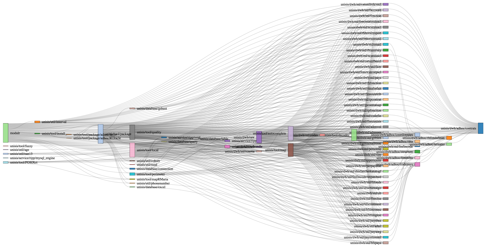

---
output:
  html_document:
    keep_md: yes
    self_contained: no
    variant: markdown_github
---

<!-- README.md is generated from README.Rmd. Please edit the .Rmd file -->

```{r, echo=FALSE, results='hide', message=FALSE}
library(htmltools)
library(networkD3)
library(webshot)
library(dplyr)
knitr::opts_chunk$set(
  collapse = TRUE,
  comment = "#>",
  fig.path = "README-"
)

Sys.setlocale("LC_TIME", "en_DK.UTF-8")
Sys.setenv(TZ = 'UTC')

```

[](https://travis-ci.org/aclemen1/modulr?branch=devel)
[](http://codecov.io/github/aclemen1/modulr?branch=devel)
[](https://github.com/aclemen1/modulr/pulls)
[](http://waffle.io/aclemen1/modulr)
[](https://github.com/aclemen1/modulr/stargazers)
[](https://github.com/aclemen1/modulr/network)
[](http://aclemen1.mit-license.org/license.html)
[](https://twitter.com/intent/tweet?text=modulr%20-%20%20A%20Dependency%20Injection%20Framework%20for%20R)

# Modulr — A Dependency Injection Framework for R

*Until the forthcoming CRAN submission, the documentation of modulr is "work in progress". Thank you for your understanding.*

## Description

Modulr is a Dependency Injection (DI) framework for R which allows to break down sequential programs into discrete, modular units that are loosely coupled, simple to develop, test, debug, maintain, reuse, and share. 

Modulr is widely inspired from Google's [AngularJS](https://angularjs.org/) developpment framework for web applications in Javascript and from Google's [Guice](https://github.com/google/guice) developpment framework for Java. It is also inspired from [GNU Make](https://www.gnu.org/software/make).

## Hello World!

```{r}
library(modulr)

# This is our first module definition: 
# "foo" provides the "Hello" character string.
"foo" %provides% { "Hello" }

# The module "bar" provides "World".
"bar" %provides% { "World" }

# And the module "foobar" requires "foo" and "bar", 
# and provides a concatenated string.
"foobar" %requires% list(f = "foo", b = "bar") %provides% {
  paste0(f, " ", b, "!")
}

# "foobar" is evaluated and its result bound to a variable.
result <- make("foobar")

cat(result)
```

## Why Dependency Injection?

This section motivates the use of DI in R. It mainly resumes the motivation and explanation given for [Angular's use of DI](https://docs.angularjs.org/guide/di) (credit to Google). For in-depth discussion about DI, see [Dependency Injection](http://en.wikipedia.org/wiki/Dependency_injection) at Wikipedia, [Inversion of Control](http://martinfowler.com/articles/injection.html) by Martin Fowler, or read about DI in your favorite software design pattern book.

Generally speaking, there are only three ways a component can get a hold of its dependencies:

1. The component can create the dependency, typically by binding a new object to an environment in R.
2. The component can look up the dependency, by referring to a global variable.
3. The component can have the dependency passed to it where it is needed.

The first two options of creating or looking up dependencies are not optimal because they hard code the dependency to the component. This makes it difficult, if not impossible, to modify the dependencies. This is especially problematic in tests, where it is often desirable to provide mock dependencies for test isolation.

The third option is the most viable, since it removes the responsibility of locating the dependency from the component. The dependency is simply handed to the component. To illustrate this, let's build a simplistic car composed of a roaring engine and some gleaming wheels.

```{r}
# This function returns a roaring engine.
engine_provider <- function() {
  list(
    start = function() message("Engine started."),
    stop = function() message("Engine stopped.")
  )
}

# This function returns gleaming wheels.
wheels_provider <- function() {
  list(
    roll = function() message("Wheels rolling."),
    brake = function() message("Wheels braking.")
  )
}

# This function returns a car provided with an engine and some wheels.
car_provider <- function(engine, wheels) {
  list(
    start = function() {
      message("Car started.")
      engine$start()
    },
    drive = function(speed, destination) {
      wheels$roll()
      message("Car driving at ", speed, " to ", destination, ".")
      wheels$brake()
    },
    stop = function() {
      engine$stop()
      message("Car stopped")
    }
  )
}
```

In the above example, `car_provider` is not concerned with creating or locating the `engine` and `wheels` dependencies, it is simply handed the `engine` and `wheels` when it is called. It is desirable, but it puts the responsibility of getting hold of the dependencies on the code that calls `car_provider`.

```{r}
engine <- engine_provider()
wheels <- wheels_provider()
car <- car_provider(engine, wheels)

car$start()
car$drive("50 km/h", "home")
car$stop()
```

For instance, if one decides to change `wheels`, a new dependency has to be explicitly created and passed to `car_provider`.

To manage the responsibility of dependency creation, modulr relies on an _injector_. The injector is a [service locator](http://en.wikipedia.org/wiki/Service_locator_pattern) that is responsible for construction and lookup of dependencies. Here is an example of using the injector service:

Create a new injector that can provide modules.

```{r}
library(modulr)
my_injector <- new_injector()
```

Teach the injector how to build the `car`, `engine` and `wheels` modules. Notice that `car` is dependent on the `engine` and `wheels` modules.

```{r}
my_injector$provider(
  name = "car", 
  dependencies = list(engine = "engine", wheels = "wheels"), 
  provider = car_provider)

my_injector$provider(name = "engine", provider = engine_provider)

my_injector$provider(name = "wheels", provider = wheels_provider)
```

Request our `car` module from the injector.

```{r}
car <- my_injector$get("car")

car$start(); car$drive("120 km/h", "the University of Lausanne"); car$stop()
```

In this setting, changing `wheels` is then straightforward:

```{r}
my_injector$provider(
  name = "wheels", 
  provider = function() {
    list(
      roll = function() message("Brand-new wheels rolling."),
      brake = function() message("Brand-new wheels braking.")
    )
  }
)

car <- my_injector$get("car")

car$start(); car$drive("150 km/h", "the University of Lausanne"); car$stop()
```

Notice that the injector did only re-evaluate `wheels` and `car`, while `engine` was kept untouched: modulr treats modules as [singletons](https://en.wikipedia.org/wiki/Singleton_pattern).

Asking for dependencies solves the issue of hard coding, but it also means that the injector needs to be passed throughout the application. Passing the injector breaks the [Law of Demeter](http://en.wikipedia.org/wiki/Law_of_Demeter). To remedy this, we combine the use of an ambient injector (a default injector is bound to modulr) and a declarative notation, to hand the responsibility of creating modules over the injector, as in this example:

```{r, echo=FALSE, results='hide', message=FALSE}
modulr::reset()
```

```{r}
"car" %requires% list(engine = "engine", wheels = "wheels") %provides% car_provider

"engine" %provides% engine_provider

"wheels" %provides% wheels_provider

car <- make("car")

car$start(); car$drive("120 km/h", "the University of Lausanne"); car$stop()
```

When modulr _makes_ a module, it asks the ambient injector to create the dependencies. The injector infers the names of the dependencies by examining the module declaration, constructs the related [directed acyclic graph](https://en.wikipedia.org/wiki/Directed_acyclic_graph) and computes a [topological sort](https://en.wikipedia.org/wiki/Topological_sorting) to produce a well ordered sequence of evaluations. This is all done behind the scenes.

```{r fig1, echo=F}
# Do not try to produce a snapshot on Travis CI or CRAN
if (!identical(Sys.getenv("TRAVIS"), "true") &&
      identical(Sys.getenv("NOT_CRAN"), "true")) {
  plot_dependencies() %>%
    html_print %>%
    webshot(file = "README-fig1.png", selector = ".sankeyNetwork", delay = 2) %>%
    resize("730x") %>%
    shrink()
}
```

```{r, echo=T, eval=FALSE}
# Read from right to left to follow the dependencies.
plot_dependencies()
```




This is the best outcome. The application code simply declares the dependencies it needs, without having to deal with the injector. This setup does not break the Law of Demeter.

Finally, here is how the above example typically looks like with the use of modulr DI's philosophy and implementation:

```{r, echo=FALSE, results='hide', message=FALSE}
modulr::reset()
```

```{r}
library(modulr)

"car" %requires% list(
  engine = "engine"
) %provides% {
  #' This module can start, drive and stop a car.
  # It just returns a list of methods.
  list(
    start = function() {
      message("Car started.")
      engine$start()
    },
    drive = function(speed, destination) {
      wheels$roll()
      message("Car driving at ", speed, " to ", destination, ".")
      wheels$brake()
    },
    stop = function() {
      engine$stop()
      message("Car stopped")
    }
  )
}

"engine" %provides% {
  #' This module can start and stop an engine.
  list(
    start = function() message("Engine started."),
    stop = function() message("Engine stopped.")
  )
}

"wheels" %provides% {
  #' This module can roll and brake wheels.
  list(
    roll = function() message("Wheels rolling."),
    brake = function() message("Wheels braking."),
  )
}

info("car") ## `info()` outputs #'-comments (aka docstrings)

car %<=% "car" ## syntactic sugar for `<- make(`

car$start(); car$drive("the speed of light", "the boundaries of the universe"); car$stop()
```

## Other advantages

* Modulr helps to circumvent errors occurring in a chain of nested dependent modules, showing [breadcrumbs](https://en.wikipedia.org/wiki/Breadcrumb_(navigation)).
* Modulr is designed to ease production of mocks for testing purpose and is therefore well-suited for [test-driven development](https://en.wikipedia.org/wiki/Test-driven_development).
* Modulr offers [docstrings](https://en.wikipedia.org/wiki/Docstring)-like comments for documenting the internals of a module.
* Modulr understands [R Markdown](http://rmarkdown.rstudio.com/) and [Sweave](https://www.statistik.lmu.de/~leisch/Sweave/), thanks to Yihui Xie's [knitr](http://yihui.name/knitr/) package.
* Modulr takes advantage of [semantic versioning](http://semver.org/) to avoid _version lock_ and _version promiscuity_.
* Modulr allows parallelization using [futures](https://en.wikipedia.org/wiki/Futures_and_promises), thanks to Henrik Bengtsson's [future](https://github.com/HenrikBengtsson/future) package.
* Modulr implements __package isolation__ as an experimental feature: following the philosophy of Jim Hester's [withr](https://github.com/jimhester/withr) package, the 'with_' method `with_no_packages()` can be used to run code with temporarily no loaded or attached R packages.
* Modulr can use [GitHub](http://github.com) (repositories and gists) to publish and share modules (so-called _gears_). See [`modulr/vault`](https://gist.github.com/aclemen1/3fcc508cb40ddac6c1e3) for an example.

Please read the vignette to see examples in action: `vignette("guide", package = "modulr")`.

## Installation

<!---
You can install:

* the latest released version from CRAN with

``` r
install.packages("modulr")
```
* the latest released version from Github with
``` r
if (packageVersion("devtools") < 1.8) {
  install.packages("devtools")
}
devtools::install_github("aclemen1/modulr")
```

* the latest _bleeding edge_ development version from Github with
-->
``` r
install.packages("devtools")
devtools::install_github("hadley/devtools")
devtools::install_github("aclemen1/modulr@devel")
```

If you encounter a clear bug, please [file a minimal reproducible example](https://github.com/aclemen1/modulr/issues).

## Real world application

This is the dependency graph of a module which exposes tidy, exhaustive, statistics-ready, and daily HR data for the [University of Lausanne](http://www.unil.ch), Switzerland. These modules have been developped and are maintained by a small team of Data Scientists. Although not shown here, many of these modules are reused in other projects. The University of Lausanne has been running modulr in [mission critical applications](http://www.unil.ch/statistiques) since March 2015.


## Related approaches

_In alphabetical order._

* Rich FitzJohn's [remake](http://github.com/richfitz/remake) package.
* Lev Kuznetsov's [injectoR](http://dfci-cccb.github.io/injectoR) package.
* Konrad Rudolph's [modules](http://github.com/klmr/modules) package.

## Code of conduct

In order to have a more open and welcoming community, modulr adheres to a [Contributor Code of Conduct](CONDUCT.md). Please adhere to this code of conduct in any interactions you have in the modulr community. It is strictly enforced on all official modulr repositories, websites, and resources. If you encounter someone violating these terms, please let the maintainer know and he will address it as soon as possible.
