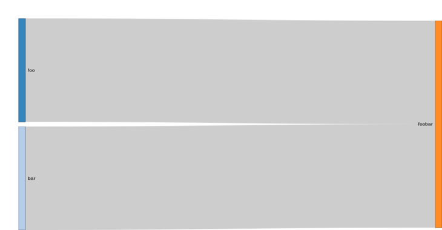

```{r, echo = FALSE, message = FALSE, results = 'hide'}
library(modulr)
library(htmltools)
library(networkD3)
require(webshot) # not on CRAN
library(future)
library(dplyr)
`%<=%` <- modulr::`%<=%`
Sys.setlocale("LC_TIME", "en_DK.UTF-8")
Sys.setenv(TZ = 'UTC')
knitr::opts_chunk$set(
  collapse = TRUE,
  comment = "#>",
  fig.path = "introduction-"
)
```

# What is modulr?

Technically, modulr is a [Dependency Injection](https://en.wikipedia.org/wiki/Dependency_injection) (DI) framework for R. It allows to break down sequential programs into discrete, modular units that are loosely coupled, simple to develop, test, reuse and share. 

As every DI framework, modulr aims for a clear separation between code complication and complexity, highlighting the 
core purpose and behavior of objects (application code), and hiding their construction and wiring (infrastructure code).

Less pompously, modulr deals with modules and their dependencies. 

Modules are declaratively defined and have four main components:

* A name, which uniquely identifies the module.
* A list of required dependencies, if any.
* A provider, which expresses the module's feature(s).
* An optional docstring, intended to document the module.

A typical module looks like the following:

```r
"name_of_module" %requires% list(

  # a list of dependencies
  dependency_1 = "name_of_dependency_1",
  dependency_2 = "name_of_dependency_1"

) %provides% {

  #' a docstring intended to document the module
  
  # some code that uses the objects `dependency_1` and `dependency_2"
  # returned by the modules "name_of_dependency_1" and "name_of_dependency_2"
  object <- { ... }
  
  # a resulting object, exposed by the module
  return(object)

}
```

When a module is defined, modulr has to _make_ it in order to evaluate the code it provides:

```r
result <- make("name_of_module")
```

or alternatively with a handy syntactic sugar:

```r
result %<=% "name_of_module"
```

The result contains the object computed and exposed by the module. Under the hood, the dependencies have been sorted and also made, and their resulting objects injected where required.

# A first, minimal example

```{r, echo=FALSE, results='hide', message=FALSE}
reset()
```

Let us start by defining some modules and dependencies:

```{r}
"foo" %provides% "Hello"

"bar" %provides% "World"

"foobar" %requires% list(
  f = "foo",
  b = "bar"
) %provides% {
  #' Return a string containing "Hello World!".
  paste0(f, " ", b, "!")
}
```

To see a module's docstring, you can use `info`:

```{r}
info("foobar")
```

To list all the defined modules, you can use `lsmod` (or `list_modules`):

```{r}
lsmod(cols = c("name", "type", "dependencies", "childs", "size", "modified"))
```

As you can see, `foobar` has two dependencies, and `foo` and `bar` both have one child. This can be viewed graphically:

```{r, echo=F}
# Do not try to produce a snapshot on Travis CI or CRAN
if (!identical(Sys.getenv("TRAVIS"), "true") &&
      identical(Sys.getenv("NOT_CRAN"), "true")) {
  plot_dependencies() %>%
    html_print %>%
    webshot(file = "introduction-foobar.png", selector = ".sankeyNetwork", delay = 2) %>%
    resize("730x") %>%
    shrink()
}
```

```{r, echo=T, eval=F}
plot_dependencies()
```



Let us make the module `foobar` and see what it returns:

```{r}
make("foobar")
```

Voilà! All the depencencies have been evaluated, injected and processed by `modulr` to return the expected `"Hello World!"`.

```{r}
lsmod(cols = c("name", "type", "dependencies", "childs", "size", "modified"))
```

# Modules are singletons

```{r, echo=FALSE, results='hide', message=FALSE}
reset()
```

All modules are singletons in the sense that once evaluated, they always return the same cached object. This is one of the great advantages of modulr: module evaluation takes place parsimoniously, only when changes are detected or explicitely required.

```{r}
"timestamp" %provides% {
  #' Return a string containing a timestamp.
  format(Sys.time(), "%H:%M:%OS6")
}
```

Successive make calls on the module will not imply its re-evaluation:

```{r}
make("timestamp")
suppressMessages(make("timestamp"))
```

To force the re-evaluation of a module, you can use `touch`:

```{r}
touch("timestamp")
make("timestamp")
```

Otherwise, modulr will detect any change in the module's definition and re-evaluate accordingly:

```{r}
"timestamp" %provides% {
  #' Return a string containing a timestamp with more information.
  format(Sys.time(), "%Y-%m-%d %H:%M:%OS6")
}

make("timestamp")
```

# Prototyped modules

```{r, echo=FALSE, results='hide', message=FALSE}
reset()
root_config$set(".")
```

This is a fact that all modules are singletons. Nonetheless, it is possible for a module to return a function (or closure) that itself returns a desired object. In this case, such a module fakes and behaves like a so-called _prototype_.

```{r}
"timestamp" %provides% {
  function() format(Sys.time(), "%H:%M:%OS6")
}
```

```{r}
make("timestamp")()

suppressMessages(make("timestamp")())
```

It is important to emphasize that the module is still a singleton: the second make call doesn't re-evaluate. But the function that is returned by the module is itself re-evaluated each time it is called.

# Memoised modules

```{r, echo=FALSE, results='hide', message=FALSE}
reset()
```

Singletons produce cached objects at make-time and prototypes produce computed objects at run-time. Memoised modules should produce cached objects at run-time. [Memoisation](https://en.wikipedia.org/wiki/Memoization) and [Hadley Wickam's memoise package](https://github.com/hadley/memoise) give an elegant solution to this requirement.

To see the essence of what is happening, we decrease the verbosity of modulr and define `foo` requiring `timestamp`, defined as a singleton at first:

```{r}
set_verbosity(1) # messages are shown only when changes occur

"timestamp" %provides% {
  # This is a singleton.
  message("'timestamp' is evaluated...")
  format(Sys.time(), "%H:%M:%OS6")
}

"foo" %requires% list(
  timestamp = "timestamp"
) %provides% {
  "foo"
}

make("foo")
```

In this example, `timestamp` is evaluated even though it is not explicitely used by `foo`. It just computes a timestamp, but it could be virtually very time- and/or space-consuming at make-time.

Let us re-define `timestamp` as a prototype:

```{r}
"timestamp" %provides% {
  # This is a prototype.
  function() {
    message("'timestamp' is evaluated...")
    format(Sys.time(), "%H:%M:%OS6")
  }
}

make("foo")
```

Here, the evaluation consists of defining a function that returns a timestamp, only when the function is explicitely called. Even if the computation encapsulated by the function is very time- and/or space-consuming, no evaluation of the returned function takes place at make-time.

Finally, let us re-define `timestamp` as a memoised module:

```{r, echo=FALSE, results='hide', message=FALSE, warning=FALSE}
library(memoise)
```

```{r}
"timestamp" %provides% {
  # This is a memoised module.
  memoise::memoise(
    function() {
      message("'timestamp' is evaluated...")
      format(Sys.time(), "%H:%M:%OS6")
    }
  )
}

make("foo")
```

The `timestamp` module returns a function which will be evaluated only when explicitely called at run-time. Let us re-define `foo` in order that it uses `timestamp`.

```{r}
"foo" %requires% list(
  timestamp = "timestamp"
) %provides% {
  message("It is ", timestamp())
  "foo"
}

make("foo")
```

Here, a timestamped message is outputed. Let us force the re-evaluation of `foo`.

```{r}
touch("foo")
make("foo")
```

The memoised version of `timestamp` is evaluated only at run-time, not at make-time; moreover, the string containing the actual timestamp is computed only once and then cached for future calls, avoiding re-evaluation.

To force re-evaluation of the memoised function exposed by `timestamp`, use `memoise::forget`.

```{r}
memoise::forget(make("timestamp"))
touch("foo")
make("foo")
```

# Futurized modules

Using [Henrik Bengtsson's future package](https://cran.r-project.org/web/packages/future), it is possible to evaluate modules asynchronously using various resources available to the user. For instance, evaluation of modules can be eager, lazy, and/or parallelized (on multiple cores and/or a cluster).

```{r, echo=FALSE, results='hide', message=FALSE, warning=FALSE}
modulr::reset()
library(future)
```

```{r}
# How many cores are available?
future::availableCores()

"foo" %provides% {
  future::future({
    Sys.sleep(2L)
    "Hello"
  }) %plan% multicore
}

"bar" %provides% {
  future::future({
    Sys.sleep(2L)
    "World"
  }) %plan% multicore
}

"foobar" %requires% list(
  f = "foo",
  b = "bar"
) %provides% {
  paste0(future::value(f), " ", future::value(b), "!")
}

system.time(print(make("foobar")))
```

It is often interesting to parallelize an already existing module. `modulr` comes with the handy `futurize` function for this purpose.

```{r, echo=FALSE, results='hide', message=FALSE, warning=FALSE}
modulr::reset()
```

```{r}
"foo" %provides% { Sys.sleep(2L); "Hello" }
"bar" %provides% { Sys.sleep(2L); "World" }
"foobar" %requires% list(
  f = "foo", 
  b = "bar"
) %provides% {
  paste0(f, " ", b, "!")
}

futurize("foo", strategy = future::multicore)
futurize("bar", strategy = future::multicore)

futurize(
  "foobar", 
  name = "foobar/eager", 
  dependencies = list(f = "foo/future", b = "bar/future"),
  strategy = future::eager
)

system.time(fb_eager <- make("foobar/eager"))
system.time(print(future::value(fb_eager)))
```

```{r}
touch("foo/future")
touch("bar/future")
futurize(
  "foobar", 
  name = "foobar/lazy", 
  dependencies = list(f = "foo/future", b = "bar/future"),
  strategy = future::lazy
)

system.time(fb_lazy <- make("foobar/lazy"))
system.time(print(future::value(fb_lazy)))
```


# Mixed modules

It is also possible to define modules which simultaneously present the above properties:

```{r, echo=FALSE, results='hide', message=FALSE, warning=FALSE}
modulr::reset()
```

```{r}
"timestamp" %provides% {
  timestamp <- function() {
    message("'timestamp' is evaluated...")
    format(Sys.time(), "%H:%M:%OS6")
  }
  list(
    singleton = timestamp(),
    prototype = timestamp,
    memorandum = memoise(timestamp)
  )
}

timestamp %<=% "timestamp"

timestamp$singleton
timestamp$prototype()
timestamp$prototype()
timestamp$memorandum()
timestamp$memorandum()
```

# Organizing modules

# Debugging and testing modules

# Sharing modules

# Frequently asked questions

## Is it possible to encrypt sensitive data within a module?

## How can I deal with various versions of a module?

## Is it possible to define a module dynamically?

