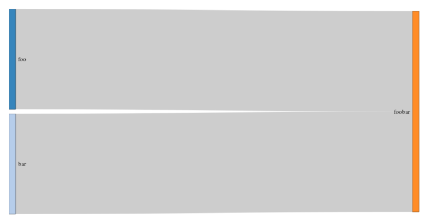

--- 
title: 
  "Introduction to modulr" 
output: 
  knitr:::html_vignette:
    toc: true
vignette: > 
  %\VignetteIndexEntry{Introduction to modulr} 
  %\VignetteEngine{knitr::rmarkdown} 
  %\VignetteEncoding{UTF-8}{inputenc} 
---

```{r, echo = FALSE, message = FALSE, results = 'hide'} 
library(modulr) 
library(htmltools) 
library(networkD3) 
require(webshot) # not on CRAN 
library(future) 
library(memoise) 
library(dplyr) 
`%<=%` <- modulr::`%<=%` 
Sys.setlocale("LC_TIME", "en_DK.UTF-8") 
Sys.setenv(TZ = 'UTC') 
knitr::opts_chunk$set(
  collapse = TRUE, 
  comment = "#>", 
  fig.path = "modulr-"
) 
set.seed(1234L) 
```

# Introduction

Modulr is a [Dependency Injection](https://en.wikipedia.org/wiki/Dependency_injection) 
(DI) framework for R. It allows to break down sequential programs into discrete, 
modular units that are loosely coupled, simple to develop, test, reuse and share. 
See the [README file](https://github.com/aclemen1/modulr) for a short introduction.

## Anatomy of a module

Modules are defined in a declarative way, using the keywords `%requires%`
and `%provides%`, and have four main components:

* A __name__, which identifies the module. 
* A list of required __dependencies__, if any. 
* A __provider__, which expresses the module's feature(s). 
* Optional __docstrings__, intended to document the internals of a module.

A typical module looks like the following:

```r
"name_of_module" %requires% list(

  # a list of dependencies 
  dependency_1 = "name_of_dependency_1", 
  dependency_2 = "name_of_dependency_1"

) %provides% {

  #' a recommended docstring intended to document the internals of the module

  # some code that uses the objects `dependency_1` and `dependency_2" 
  # returned by the modules "name_of_dependency_1" and "name_of_dependency_2" 
  object <- { ... }

  # a resulting object, exposed by the module 
  return(object)

} 
```

When a module is defined, modulr has to _make_ it in order to evaluate the code
it provides:

```r
result <- make("name_of_module") 
```

or with a handy _syntactic sugar_:

```r
result %<=% "name_of_module" 
```

or interactively with the `hit` function:

```r
hit(name_of_module) # or
hit(name_of) # which will prompt the user to choose among all possible match
```

The result contains the computed object exposed by the module. Under the
hood, the dependencies have been sorted and appropriately made, and their 
resulting objects injected where required.

## A first example

```{r, echo=FALSE, results='hide', message=FALSE} 
reset() 
```

Let us start by defining some modules and dependencies:

```{r} 
"foo" %provides% "Hello"

"bar" %provides% "World"

"foobar" %requires% list(
  f = "foo", 
  b = "bar"
) %provides% { 
  #' Return a concatenated string. 
  paste0(f, " ", b, "!") 
} 
```

Use `info` to output the docstrings:

```{r} 
info("foobar") 
```

Use `lsmod` to list all defined modules and their properties:

```{r} 
lsmod(cols = c("name", "type", "dependencies", "uses", "size", "modified")) 
```

In this example, `foobar` relies on two dependencies, and `foo` and `bar` are both injected once. 
Use `plot_dependencies` to see the tree of dependencies and injections:

```{r, echo=F} 
# Do not try to produce a snapshot on Travis CI or CRAN 
if (!identical(Sys.getenv("TRAVIS"), "true") && 
    identical(Sys.getenv("NOT_CRAN"), "true")) { 
  plot_dependencies() %>% 
    html_print %>% 
    webshot(
      file = "modulr-foobar.png", 
      selector = ".sankeyNetwork", 
      delay = 2L) %>% 
    resize("730x") %>% 
    shrink() 
} 
```

```{r, echo=T, eval=F} 
plot_dependencies() 
```



Use `make` get the resulting object provided by the module:

```{r} 
make("foobar")
```

Voilà! All the depencencies have been evaluated, injected and processed to
return the expected `"Hello World!"`.

```{r} 
lsmod(cols = c("name", "type", "dependencies", "uses", "size", "modified")) 
```

## Types of modules

### Singletons

```{r, echo=FALSE, results='hide', message=FALSE}
reset()
```

All modules are singletons: once evaluated, they always return the same resulting object. This is one of the great advantages of modulr: module evaluation takes place parsimoniously, when changes are detected or explicitely required, à la [GNU Make](https://www.gnu.org/software/make).

```{r}
"timestamp" %provides% {
  #' Return a string containing a timestamp.
  format(Sys.time(), "%H:%M:%OS6")
}
```

Successive `make` calls on the module will not imply its re-evaluation:

```{r}
make("timestamp")
with_verbosity(0, make("timestamp")) # temporarily change the verbosity of make
```

To force re-evaluation, just `touch` the module:

```{r}
touch("timestamp")
make("timestamp")
```

Any change of the module's definition (even its docstrings) will be detected:

```{r}
"timestamp" %provides% {
  #' Return a string containing a timestamp with more information.
  format(Sys.time(), "%Y-%m-%d %H:%M:%OS6")
}

make("timestamp")
```

### Prototypes

```{r, echo=FALSE, results='hide', message=FALSE}
reset()
```

It is granted that all modules are singletons. Nonetheless, a module is allowed to return any object, in particular it can return a function (closure) that itself returns a desired object or produces some side effect. In this case, such a module behaves like a so-called _prototype_.

```{r}
"timestamp" %provides% {
  function() format(Sys.time(), "%H:%M:%OS6")
}
```

```{r}
make("timestamp")()

with_verbosity(0L, make("timestamp")())
```

It is important to emphasize that the module is still a singleton: the second `make` call doesn't re-evaluate. But the function that is returned by the module is itself re-evaluated each time it is called. Notice the `with_verbosity` wrapper around the call.

### Memoised prototypes

```{r, echo=FALSE, results='hide', message=FALSE}
reset()
```

Singletons produce cached objects at make-time and prototypes produce computed objects at run-time. In a complementary manner, memoised modules produce cached objects at run-time. [Memoisation](https://en.wikipedia.org/wiki/Memoization) and [Hadley Wickam's memoise package](https://github.com/hadley/memoise) give an elegant solution to this requirement.

To see the essence of what is happening, we decrease the verbosity of modulr and set up a simple starting scenario: `foo` requires the somewhat resource-consuming `timestamp` module, defined as a singleton:

```{r}
set_verbosity(1L) # messages are shown only when changes occur

"timestamp" %provides% {
  # This is a singleton.
  message("'timestamp' is evaluated after a (short) pause...")
  Sys.sleep(1L)
  format(Sys.time(), "%H:%M:%OS6")
}

"foo" %requires% list(
  timestamp = "timestamp"
) %provides% {
  "foo"
}

system.time(make("foo"))
```

In this example, `timestamp` is evaluated even though it is not explicitely used by `foo`. It just computes a timestamp after a short pause, but it could be virtually very resource-consuming at make-time.

Let us re-define `timestamp` as a prototype:

```{r}
"timestamp" %provides% {
  # This is a prototype.
  function() {
    message("'timestamp' is evaluated after a (short) pause...")
    Sys.sleep(1L)
    format(Sys.time(), "%H:%M:%OS6")
  }
}

system.time(make("foo"))
```

Here, the evaluation consists of defining a function that pauses for a while and returns a timestamp, only when the function is explicitely called. Even if the computation encapsulated by the function is very resource-consuming, no evaluation of the returned function takes place at make-time.

Finally, let us re-define `timestamp` as a memoised module:

```{r, echo=FALSE, results='hide', message=FALSE, warning=FALSE}
library(memoise)
```

```{r}
"timestamp" %provides% {
  # This is a memoised module.
  memoise::memoise(
    function() {
      message("'timestamp' is evaluated after a (short) pause...")
      Sys.sleep(1L)
      format(Sys.time(), "%H:%M:%OS6")
    }
  )
}

system.time(make("foo"))
```

The `timestamp` module returns a function which will be evaluated only when explicitely called at run-time. Let us re-define `foo` in order that it effectively uses `timestamp`.

```{r}
"foo" %requires% list(
  timestamp = "timestamp"
) %provides% {
  message("It is ", timestamp())
  "foo"
}

system.time(make("foo"))
```

Here, a timestamped message is outputed. Let us force the re-evaluation of `foo`.

```{r}
touch("foo")
system.time(make("foo"))
```

The memoised version of `timestamp` is evaluated only at run-time, not at make-time; moreover, the string containing the actual timestamp is computed only once and then cached for future calls, avoiding re-evaluation.

To force re-evaluation of the memoised function exposed by `timestamp`, use `memoise::forget`.

```{r}
memoise::forget(make("timestamp"))
touch("foo")
system.time(make("foo"))
```

### Lists

It is often useful for a module to expose several (immutable, cf. infra) objects at once by returning a list.

```{r, echo=FALSE, results='hide', message=FALSE, warning=FALSE}
modulr::reset()
```

```{r}
"timestamps" %provides% {
  now <- function() Sys.time()
  list(
    origin = structure(0L, class = "Date"),
    yesterday = function() now() - 86400L,
    now = now,
    tomorrow = function() now() + 86400L
  )
}

ts %<=% "timestamps"

ts$origin
ts$yesterday()
ts$now()
ts$tomorrow()
```

### Environments

It is often useful for a module to expose several mutable objects at once by returning an environment.

```{r, echo=FALSE, results='hide', message=FALSE, warning=FALSE}
modulr::reset()
```

```{r}
"configuration" %provides% {
  env <- new.env(parent = emptyenv())
  env$shape <- "circle"
  env$color <- "blue"
  env$size <- 13L
  env
}

config %<=% "configuration"

config$color
config$color <- "red"
config$color
```

This kind of module can be used to share mutable data between modules, without polluting the Global Environment.

```{r}
"widget_A" %requires% list(
  config = "configuration"
) %provides% {
  list(
    switch_color = function()
      config$color <- if (config$color == "blue") "red" else "blue"
  )
}

"widget_B" %requires% list(
  config = "configuration"
) %provides% {
  list(
    switch_shape = function()
      config$shape <- if (config$shape == "circle") "square" else "circle"
  )
}

widget_A %<=% "widget_A"
widget_B %<=% "widget_B"

widget_A$switch_color()
config$color

widget_B$switch_shape()
config$shape
```

The modulr package implements the dedicated syntactic sugar `%provides_options%` for this frequent purpose.

```{r}
undefine("configuration")

"configuration" %provides_options% list(
  shape = "circle",
  color = "blue",
  size = 13L
)

config %<=% "configuration"
widget_A %<=% "widget_A"

config$color
widget_A$switch_color()
config$color
```

### Futures

Using [Henrik Bengtsson's future package](https://cran.r-project.org/web/packages/future), it is possible to evaluate modules asynchronously using various resources available to the user. For instance, evaluation of modules can be eager, lazy, and/or parallelized (on multiple cores and/or on a cluster of machines).

```{r, echo=FALSE, results='hide', message=FALSE, warning=FALSE}
modulr::reset()
library(future)
```

```{r}
# How many cores are available?
availableCores()

"foo" %provides% {
  future({
    Sys.sleep(1L)
    "Hello"
  }) %plan% multicore
}

"bar" %provides% {
  future({
    Sys.sleep(1L)
    "World"
  }) %plan% multicore
}

"foobar" %requires% list(
  f = "foo",
  b = "bar"
) %provides% {
  paste0(value(f), " ", value(b), "!")
}

system.time(print(make("foobar")))
```

It is often interesting to parallelize an already existing module. `modulr` comes with the handy `futurize` function for this purpose. The following two examples illustrate the difference between eager and lazy orchestrations of parallelized modules.

```{r, echo=FALSE, results='hide', message=FALSE, warning=FALSE}
modulr::reset()
```

```{r}
"foo" %provides% { Sys.sleep(1L); "Hello" }
"bar" %provides% { Sys.sleep(1L); "World" }
"foobar" %requires% list(
  f = "foo", 
  b = "bar"
) %provides% {
  paste0(f, " ", b, "!")
}

futurize("foo", strategy = multicore)
futurize("bar", strategy = multicore)

futurize(
  "foobar", 
  name = "foobar/eager", 
  dependencies = list(f = "foo/future", b = "bar/future"),
  strategy = eager
)

system.time(fb_eager <- make("foobar/eager"))
system.time(print(value(fb_eager)))
```

```{r}
touch("foo/future")
touch("bar/future")
futurize(
  "foobar", 
  name = "foobar/lazy", 
  dependencies = list(f = "foo/future", b = "bar/future"),
  strategy = lazy
)

system.time(fb_lazy <- make("foobar/lazy"))
Sys.sleep(0.5)
system.time(print(value(fb_lazy)))
```

## Semantic Versioning (SemVer)

The modulr package offers [Semantic Versioning](http://semver.org) capabilities: 
every module can live in several versions numbers of the form `x.y.z`, where _x_, _y_, 
and _z_ are the __major__, __minor__, and __patch__ versions, respectively. 
For instance, `foo#1.2.3` designates module _foo_ in version _1.2.3_.

Given a version number, increment the:

* __major__ version when you make incompatible changes,
* __minor__ version when you refactor and/or add functionality in a backwards-compatible manner, and
* __patch__ version when you make backwards-compatible bug fixes.

For instance, `foo#1.2.3` becomes `foo#1.2.4` after a bug fix and `foo#1.3.0` after a functionality bump.

Use:

* `~x.y.z` to refer to the most up-to-date available patch version above _x.y.z_ and __allow bug fixes, but nothing else__,
* `^x.y.z` or `^x.y` to refer to the most up-to-date available minor version above _x.y_ and __allow bug fixes and new functionalites, but nothing else__, and
* `>=x.y.z`, `>=x.y`, or `>=x` to refer to the most up-to-date version above _x.y.z_, _x.y_, or _x_, and __live on the edge of developpments__.

Here are some examples among `foo#1.2.3`, `foo#1.2.4`, `foo#1.3.0`:

* `foo#~1.2.0` refers to `foo#1.2.4`,
* `foo#~1.2.5` refers to nothing,
* `foo#^1.2.5` and `foo#^1.1` refer to `foo#1.3.0`,
* `foo#^1.3.1` and `foo#^1.4` refer to nothing, and
* `foo#>=1.1.0`, `foo#>=1.5`, and `foo#>=0` (aka _latest_) refer to `foo#1.3.0`.

### Initial scenario: no versioning

There is a good chance that your initial scenario contains no versioned module.

```{r}
"great_module" %provides% {
  function() {
    Sys.sleep(1L)
    "great features"
  }
}
```

```{r}
"complex_module" %requires% list(
  great = "great_module"
) %provides% {
  function() cat(paste("complex module using", great()))
}
```

```{r}
system.time(make("complex_module")())
```

In this scenario, `great_module` does what it is supposed to do, but clearly not very efficiently. 
You then decide to work on a new version that improves its performance.

### Setting-up versioning

First, we clone `great_module` with an initial version number.

```{r}
"great_module#0.1.0" %clones% "great_module"
```

We then adapt the requirements where `great_module` is injected as a dependency: for `complex_module`, we decide to accept bug fixes, refactorisations, and new functionalities, as long as the API does not change in an incompatible backward manner.

```{r}
"complex_module" %requires% list(
  great = "great_module#^0.1.0"
) %provides% {
  function() cat(paste("complex module using", great()))
}
```

```{r}
system.time(make("complex_module")())
```

Here is the minor bump of `great_module`, which is a little bit more efficient.

```{r}
"great_module#0.2.0" %provides% {
  # Improved internals, same interface
  function() "great optimisd features"
}
```
```{r}
system.time(make("complex_module")())
```

And here is the latest bug fix correcting the typo.

```{r}
"great_module#0.2.1" %provides% {
  # Bug fix
  function() "great optimised features"
}
```

```{r}
make("complex_module")()
```


## Location of modules

Modules can be defined in several locations: in-memory, on-disk in its own file or along another module's file, and remotely on GitHub's Gist or via the HTTP(S) protocol.

### In-memory

This is the most direct method to define a module. This is also the most volatile, 
since the lifespan of the module is limited to the R session.

```{r, echo=FALSE, results='hide', message=FALSE, warning=FALSE}
modulr::reset()
```

```{r}
"foo" %provides% "bar"
lsmod(cols = c("name", "storage", "along", "filepath", "url"))
```

### On-disk

```{r include=FALSE}
modulr::reset()
```

This is the way to go when a module is intended to be reused. In such a case, 
the definition takes place in a dedicated R, R Markdown, or R Sweave file, which 
path and name are closely related to the module's name.

For instance, the following module definition is stored in the R file `swissknife.R`, under the sub-directory `vendor/tool` of the `./modules` directory.

```{r, code=readLines(file.path("modules", "vendor", "tool", "swissknife.R")), eval = FALSE}
```

When a module is invoked, modulr searches for it in-memory first, then on-disk if necessary. There are several default __root__ places where modulr looks for the module's file: `./modules/`, `./module/`, `./libs/`, `./lib/`, and `./`. This behaviour can be configured with the help of `root_config`.

```{r}
root_config$get_all()
```

This explains why modulr finds the module `vendor/tool/swissknife` under the file `./modules/vendor/tool/swissknife.R`.

```{r}
my_swissknife %<=% "vendor/tool/swissknife"
```

This also works with R Markdown `.Rmd` and R Sweave `.Rnw` files.

```{r echo=FALSE, comment='', highlight=TRUE}
cat(readLines(file.path("modules", "vendor", "tool", "multitool.Rmd")), sep = "\n")
```

```{r}
load_module("vendor/tool/multitool") # load only, do not make
```

```{r}
lsmod(cols = c("name", "storage", "along", "filepath", "url"))
```

### Along another module

### Remote (_modulr gears_)

```{r include=FALSE}
modulr::reset()
```

Using GitHub's [Gist](https://gist.github.com) is a simple way to share modules with others. To illustrate this, let us consider the following remote module, aka __modulr gear__: [https://gist.github.com/aclemen1/3fcc508cb40ddac6c1e3](https://gist.github.com/aclemen1/3fcc508cb40ddac6c1e3).

```{r}
"modulr/vault" %imports% "https://gist.github.com/aclemen1/3fcc508cb40ddac6c1e3"
```

Notice that only specifiying the gist ID in `"modulr/vault" %imports% "3fcc508cb40ddac6c1e3"` has the same effect. It is possible to import modules from any URL using the HTTP(S) protocol.

Once imported, a remote module appears to be in-memory defined. 

```{r}
lsmod(cols = c("name", "storage", "along", "filepath", "url"))
```

To use a remote module as a dependency, just import it where needed (even in a remote module).

```{r}
"modulr/vault" %imports% "3fcc508cb40ddac6c1e3"

"module/using/a/gear" %requires% list(
  vault = "modulr/vault"
) %provides% {
  vault$decrypt(
    secret = "TWUnCkRAlP70XvmRlnAFrw==",
    key = "EaJWzAZjjphu9CoA+MPUVCL8mmMAGp0j6Nbga29kV/A=")
}

make()
```

Notice that sharing a module is as easy as sending this one-liner code snippet:

```r
library(modulr); "modulr/vault#^0.1.0" %imports% "3fcc508cb40ddac6c1e3"
```


## Testing

Testing is a very important aspect of programming and modulr is well-suited for this purpose.

### Single module

```{r, echo=FALSE, results='hide', message=FALSE, warning=FALSE}
modulr::reset()
```

Let us consider the following module, exposing a function which computes the first
terms of the infinite sequence of powers of $2$: $2^0=1$, $2^1=2$, $2^2=4$, $2^3=8$, etc.

```{r}
"powers_of_2" %provides% {
  function(terms = 10L) {
    2L ^ (seq_len(terms) - 1L)
  }
}
```

For all $n\geq1$, let $(x_1, ..., x_n)$ the sequence consisting of the first $n$ powers of $2$. Let us suppose that we want to perform elementary tests on some of these sequences: a. $x_1=1$, b. $x_n=2^{n-1}$, and c. $x_{i+1} = 2x_i$ for all $1\leq i\leq n-1$.

Let us then define `powers_of_2/test`, a dedicated module for testing `powers_of_2` using Hadley Wickham's [testthat](https://github.com/hadley/testthat) package.

```{r}
"powers_of_2/test" %requires% list(
  powers_of_2 = "powers_of_2"
) %provides% {
  library(testthat)
  test_that("First term is 1", {
    for (terms in sample(1L:50L, 3L, replace = FALSE)) {
      expect_equal(
        powers_of_2(terms)[1L],
        1L
      )
    }
  })
  test_that("Last term is as expected", {
    for (terms in sample(1L:50L, 3L, replace = FALSE)) {
      expect_equal(
        tail(powers_of_2(terms), 1L),
        2L ^ (terms - 1L)
      )
    }
  })
  test_that("Any two consecutive terms are as expected", {
    for (terms in sample(2L:50L, 3L, replace = FALSE)) {
      series <- powers_of_2(terms)
      for (index in sample(1L:(terms - 1L), min(10L, (terms - 1L)), 
                           replace = FALSE)) {
        expect_equal(series[index] * 2, series[index + 1L])
      }
    }
  })
}
```

In order to run the tests, it is sufficient to evaluate this module.

```{r}
make("powers_of_2/test")
```

It is also possible to run all available tests.

```{r}
make_tests()
```

To illustrate the situation where some test fails, let us consider a faulty version of `powers_of_2`.

```{r}
"powers_of_2" %provides% {
  function(terms = 10L) {
    sequence <- 2L ^ (seq_len(terms) - 1L)
    # This is a faulty version.
    sequence[1L] <- 0L
  }
}
```

```{r}
try(make_tests())
```

### Module with _mocked_ dependencies

```{r, echo=FALSE, results='hide', message=FALSE, warning=FALSE}
modulr::reset()
```

Let us consider the following module, which relies on RStudio's [cranlogs](https://github.com/metacran/cranlogs) 
package to request the list of top downloaded packages from their CRAN mirror.

```r
"get_top_downloads" %provides% {
  library(cranlogs)
  function(when = "last-week", count = 100L) {
    cran_top_downloads(when = when, count = count)
  }
}
```

```{r, echo=FALSE, results='hide', message=FALSE, warning=FALSE}
modulr::reset()
"get_top_downloads" %provides% {
  function(...) {
    structure(
      list(
        rank = 1:10, 
        package = c(
          "Rcpp", "ggplot2", "tibble", "stringi", "stringr", "lazyeval", 
          "digest", "R6", "curl", "DBI"), 
        count = c(103853L, 98595L, 91533L, 83672L, 80901L, 80409L, 78169L, 
                  77429L, 77094L, 74321L), 
        from = structure(c(17291, 17291, 17291, 17291, 17291, 17291, 17291, 
                           17291, 17291, 17291), class = "Date"), 
        to = structure(c(17297, 17297, 17297, 17297, 17297, 17297, 17297, 
                         17297, 17297, 17297), class = "Date")), 
      .Names = c("rank", "package", "count", "from", "to"), 
      row.names = c(NA, -10L), 
      class = "data.frame")
  }
}
```

The following module uses Hadley Wickham's [ggplot2](https://github.com/tidyverse/ggplot2) package to plot the list of top downloaded packages.

```{r}
"plot_top_downloads" %requires% list(
  get_top_downloads = "get_top_downloads"
) %provides% {
  library(ggplot2)
  function(when = "last-week", count = 10L) {
    top_downloads <- get_top_downloads(when = when, count = count)

    ggplot(data = top_downloads, 
           aes(x = top_downloads$package, y = top_downloads$count)) + 
      theme_light() + 
      theme(axis.text.x = element_text(angle = 90.0, hjust = 1.0)) + 
      geom_bar(stat = "identity") + 
      scale_x_discrete(limits = top_downloads$package) +
      labs(
        title = sprintf(
          "Top %d Downloads (%s, RStudio's CRAN mirror)", 
          count,
          format(unique(top_downloads$to), format = "%Y-%m-%d")), 
        x = "Package", y = "Count")
    
  }
}

plot_top_downloads %<=% "plot_top_downloads"

plot_top_downloads()
```

Testing this module directly would require to be connected on the internet and would stress the RStudio's remote API, which is very bad practice. In order to avoid such prohibited behaviour, it is recommended to define new modules that _mock_ the original functionalities.

```{r}
"get_top_downloads/mock" %provides% {
  library(tibble)
  function(...) {
    tribble(
      ~rank, ~package, ~count, ~from, ~to,
      1L, "Rcpp", 105000L, as.Date("2017-05-05"), as.Date("2017-05-11"),
      2L, "ggplot2", 100000L, as.Date("2017-05-05"), as.Date("2017-05-11"),
      3L, "tibble", 90000L, as.Date("2017-05-05"), as.Date("2017-05-11")
    )
  }
}
```

```{r}
"plot_top_downloads/mock" %requires% list(
  get_top_downloads = "get_top_downloads/mock"
) %provides% get_provider("plot_top_downloads")
```

Notice the use of `get_provider("plot_top_downloads")` in the second definition: `plot_top_downloads/mock` requires `get_top_downloads/mock`, a _mocked_ version of `get_top_downloads`, but provides the same features as `plot_top_downloads`; change the definition of `plot_top_downloads` and it will change the definition of `plot_top_downloads/mock` at the same time.

Along the lines of the first example, you can then define a testing module.

```{r}
"plot_top_downloads/test" %requires% list(
  plot_top_downloads = "plot_top_downloads/mock"
) %provides% {
  library(testthat)
  plot <- plot_top_downloads()
  test_that("X-Axis is labelled 'Package'", {
    expect_identical(plot$labels$x, "Package")
  })
  test_that("Y-Axis is labelled 'Count'", {
    expect_identical(plot$labels$y, "Count")
  })
  test_that("Plot layers match expectations", {
    expect_is(plot$layers[[1L]], "ggproto")
    expect_is(plot$layers[[1L]]$geom, "GeomBar")
    expect_is(plot$layers[[1L]]$stat, "StatIdentity")
  })
}
```

```{r}
make_tests()
```

As a last example, it is considered a good practice to provide all __modulr gears__ with appropriate tests, as illustrated by [https://gist.github.com/aclemen1/3fcc508cb40ddac6c1e3](https://gist.github.com/aclemen1/3fcc508cb40ddac6c1e3).

```{r, include=FALSE}
modulr::reset()
```

```{r}
"modulr/vault" %imports% "3fcc508cb40ddac6c1e3"
make_tests()
```

## Special variables

### `.Last.name`

When a module is defined, touched, or made, its name is always assigned to `.Last.name`.
The special variable `.Last.name` is also used as a default parameter for `make`, `touch`, and `undefine`.

```{r, echo=FALSE, results='hide', message=FALSE, warning=FALSE}
modulr::reset()
```

```{r}
"foo" %provides% "bar"

.Last.name

make()

touch()

undefine()
```

### Module's metadata

```{r echo=FALSE, results='hide', message=FALSE, warning=FALSE, cache=FALSE}
modulr::reset()
```

Every module has access to some of its metadata: name, version, file path (when on-disk), etc. 
The following module illustrates this feature and is self-explanatory.

```{r, code=readLines(file.path("modules", "my", "great", "module", "reflection.R")), eval = FALSE}
```

```{r}
with_verbosity(0L, make("my/great/module/reflection"))
```


## The special module `modulr`

The modulr package defines a special module named `modulr` that can be injected in any
module. The purpose of this special module is to give access to useful helper 
functions related to the module into which it is injected.

```{r}
info("modulr")
```
### Messages

TODO

### Post-evaluation hook

There are situations where a post-evaluation hook is needed. For instance, to define 
an ephemeral module that can be evaluated only once, or to define a so-called _no-scoped_ 
module, which looks like a pure singleton, but behaves like a prototype.

```{r}
"ephemeral" %requires% list(
  modulr = "modulr"
) %provides% {
  modulr$post_evaluation_hook(undefine("ephemeral"))
  "A butterfly"
}

make("ephemeral") # returns a butterfly
try(make("ephemeral"), silent = TRUE) # no more
cat(geterrmessage())
```

```{r}
"no_scoped" %requires% list(
  modulr = "modulr"
) %provides% {
  modulr$post_evaluation_hook(touch("no_scoped"))
  Sys.time()
}

make("no_scoped")
Sys.sleep(1L)
make("no_scoped")
```

Notice that the expression passed to the hook is evaluated in the environment in which the module is used. Therefore, a direct call to `.__name__` would not return the name of the intuitively expected module. The following example illustrates how to circumvent this kind of difficulty.

```{r}
"no_scoped" %requires% list(
  modulr = "modulr"
) %provides% {
  eval(substitute(modulr$post_evaluation_hook(touch(me)), list(me = .__name__)))
  Sys.time()
}

make("no_scoped")
Sys.sleep(1L)
make("no_scoped")
```

## Scripting

Turning a bunch of modules working perfectly well together into a script is a 
very common situation, that can be handled with the help of the following boilerplate code:

```r
# filepath: ./script.R
"script" %requires% list(
  dep_1 = "dependency_1",
  ...
) %provides% {
  function() {
    # body of the script here
  }
}

if (.__name__ == "__main__") 
  # execute only if sourced/run as a script (à la Python)
  make()()
```

## Experimental features

### Package isolation

### _Gears_

## Coding style
